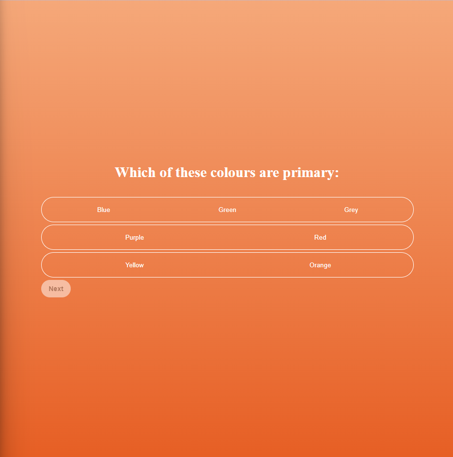
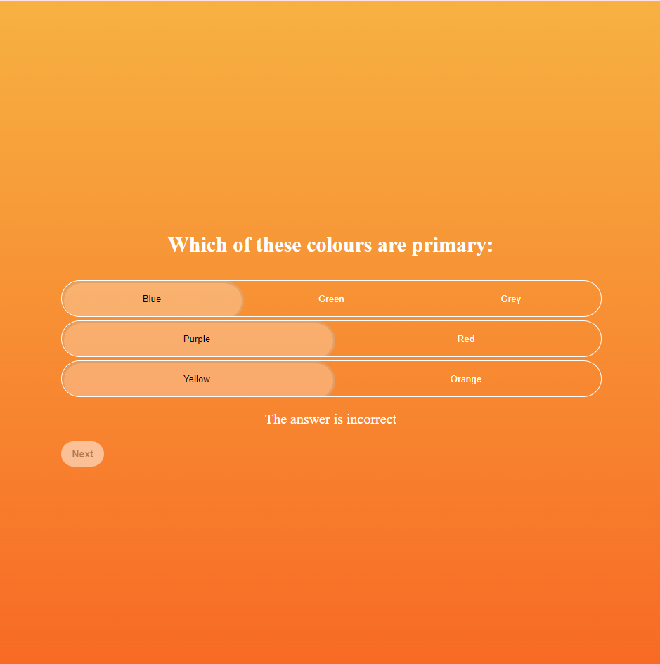
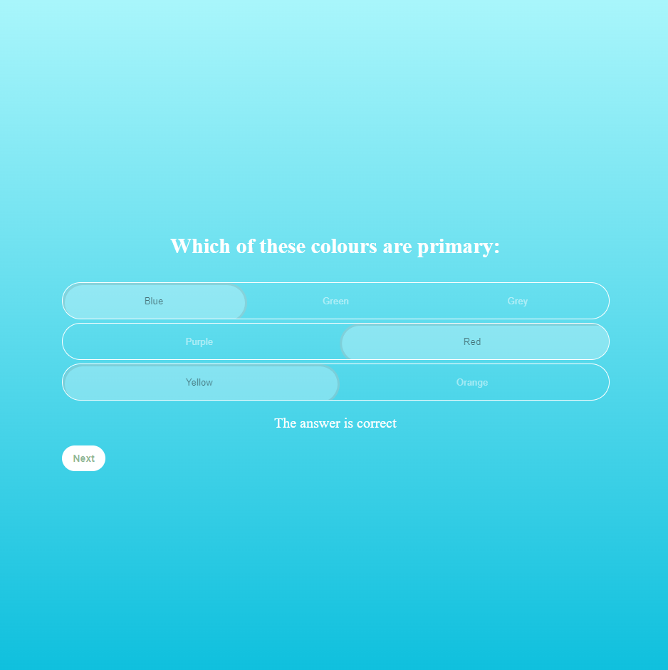

# React + TypeScript + Vite

# User Knowledge Testing Component

## This project follows and meets the criteria of the UX/UI and Project brief. It also includes some of the extention tasks that were successfully implemented. There is a separate branch you may look at where one of the extention fetaures were attempted but did not make it to the main branch as it affected the functionality of the app.

This component includes a multiple choice style quiz including a sliding toggle effect. 

Assumptions:
- Component will be used on commmon browsers such as Chrome, Safari.
- Component has been designed to be accomodated on screen sizes over 320px.
- User cannot move onto to next question unless it is answered correctly so no previous button implemented

Limitations:
- Component to be used in larger project, there is no homepage or get started features. Refresh is only way to reset
- There is no option to visit previous questions 
- Does not allow for multiple correct answers within a single row
- Questions and answers appear in order of implementation. There is no randomize feature

## Component previews:

